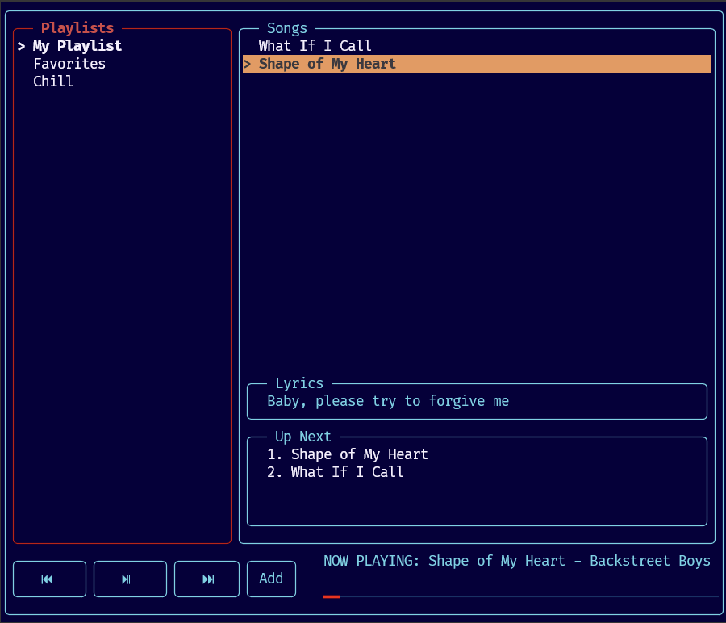

# Music Player

A terminal-based music player built with C++.



## Features

- Play audio files from the terminal
- Switch between playlists and select songs interactively
- Pause, resume, and stop playback
- Previous / next track controls
- Auto-advance to the next song when playback ends
- Interactive TUI built with FTXUI
- **Up Next queue**: enqueue songs and play them in FIFO order
- Executable-relative music path resolution (run from any working directory)

## Tech Stack

- **Language:** C++17
- **Build System:** CMake
- **UI Library:** [FTXUI](https://github.com/ArthurSonzogni/FTXUI)
- **Audio Library:** [miniaudio](https://github.com/mackron/miniaudio)

## Prerequisites

- CMake 3.16 or later
- A C++17-compatible compiler
- Git

## Build Instructions

1. Clone the repository:

   ```bash
   git clone https://github.com/rinborobin/music-player.git
   cd music-player
   ```

2. Create a build directory and run CMake:

   ```bash
   mkdir build
   cd build
   cmake ..
   ```

3. Build the project:

   ```bash
   cmake --build .
   ```

4. Run the application:

   ```bash
   ./music-player
   ```

## Project Structure

```
music-player/
├── CMakeLists.txt
├── README.md
├── docs/
│   ├── CONTRIBUTORS_GUIDE.md # Architecture and contribution guide
│   └── preview.png
├── src/
│   ├── main.cpp              # Application entry point and UI
│   ├── debug_main.cpp        # Debug portal entry point
│   ├── audio/
│   │   ├── MusicEngine.h     # Audio playback interface
│   │   ├── MusicEngine.cpp   # Audio playback implementation
│   │   └── miniaudio.h       # Single-header audio library
│   ├── data/
│   │   ├── Song.h            # Song data structure
│   │   ├── Playlist.h/.cpp   # Playlist (circular linked list)
│   │   ├── PlaylistManager.h/.cpp
│   │   ├── LyricsManager.h/.cpp
│   │   ├── Queue.h           # Playback "up next" queue
│   │   └── Queue.cpp         # Playback queue implementation
│   ├── ui/
│   │   ├── MusicPlayerUI.h   # Terminal UI interface
│   │   └── MusicPlayerUI.cpp # Terminal UI implementation
│   ├── debug/
│   │   ├── DebugCLI.h        # Debug/test CLI interface
│   │   └── DebugCLI.cpp      # Debug/test CLI implementation
│   └── utils/
│       └── Logger.h          # Lightweight logging utility
```

## Testing & Debugging

A separate command-line debug portal is available for testing audio and data features without launching the TUI:

```bash
cd build
./music-player-debug
```

This interactive menu lets you set up sample playlists, test playback controls, inspect song state, verify lyric parsing, and exercise the playback queue. See `docs/CONTRIBUTORS_GUIDE.md` for details.

## Contributing

1. Fork the repository and create a new branch for your feature or fix.
2. Make your changes in small, focused commits.
3. Follow the existing code style.
4. Use [Conventional Commits](https://www.conventionalcommits.org/) for commit messages. Examples:
   - `feat(audio): add volume control`
   - `fix(ui): resolve playlist rendering issue`
   - `chore(build): update CMake minimum version`
5. Open a pull request with a clear description of your changes.

## Roadmap

- Load songs dynamically from the `music/` directory at runtime.
- Volume control.
- Shuffle / repeat modes.

## Notes

- Place audio files in a `music/` directory at the project root or next to the executable.
- The `music/` and `build/` directories are ignored by Git.
- The project currently uses sample song paths in `src/main.cpp`. Update them to match your local audio files.
